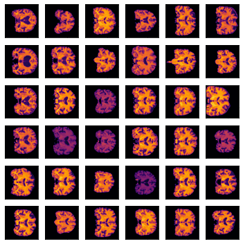
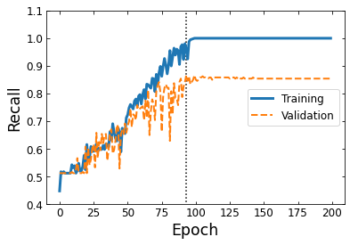

# craNNium

craNNium is a convolutional neural network that identifies patients with mild-to-severe dementia. craNNium was developed for the Erdos Institute Data Science Bootcamp 2021.

## Background
Magnetic resonance imaging (MRI) is one of the primary tools used by physicians to identify dementia. Patients with most types of dementia (Alzheimer's disease, vascular dementia, and frontotemporal lobar degeneration) exhibit structural atrophy in certain regions of the brain. However, identifying the subtle differences in brain structure can be a time-consuming process.

Deep learning methods offer an appealing way to identify dementia patients as a first-pass, but in order to be helpful in a clinical setting, these methods must have high recall and short run-time[1].

In this project, we train a convolutional neural network on T1w MRI data of 200 anonymized patients from the OASIS-3 project. OASIS-3 is a compilation of data obtained through the 30-year WUSTL Knight ADRC program of both cognitively normal adults and adults at various stages of cognitive decline[2]. OASIS-3 provides a rich and balanced dataset that may be ideal for deep learning methods.

## Methodology

We select patients from OASIS-3 by identifying equal numbers of patients with Clinical Dementia Rating (CDR) of zero (cognitively normal) and >= 1 (mild-to-severe). We select equally from female and male patients. From each patient, we take one T1-weighted, 3.0T MRI 3-dimensional scan, resulting in a total of 200 total scans, 100 cognitively normal and 100 with some level of dementia.

We pre-pre-process each scan by running each image through [fsl_anat](https://fsl.fmrib.ox.ac.uk/fsl/fslwiki/fsl_anat)[3], a common pipeline for processing MRI scans. [fsl_anat](https://fsl.fmrib.ox.ac.uk/fsl/fslwiki/fsl_anat) re-orients and crops each scan, aligns the patient head onto a common centerpoint, and extracts the brain.

From each brain, we collect 5 central slices, each 3 pixels apart, from a "top-down" orientation. We then pre-process each image by normalizing by the 99th percentile pixel value, to account for noise-related spikes in pixel value. A subset of the pre-processed images are shown below.

We split our data into 20% test, 80% training. From the training set, we extract 30% of the images for a validation set. We end up with 800 training images.

We run the images through a custom convolutional neural network architecture based on the simple architectures explored in lecture. We explored a number of different architectures, including Google's highly complex Inception_v4 architecture, but the more complex architectures tended to immediately overfit the data. We ultimately decide on the following simple architecture:

1. Input pooling layer with window size 3x3
2. An additional pooling layer with window size 3x3
2. 9 convolutional layers with depth 16, window size 3x3
3. A flattening layer to flatten the CNN feature array
4. A fully connected dense layer (size 16) that combines features
5. An output dense layer of size 2, for the two classes (dementia or no dementia)

We use ReLU activation functions in all but the output layer, where instead we use Softmax.

Finally, we run the network for 200 epochs, validating against a recall score. We choose recall as our metric since physicians likely want to identify as many true-dementia patients as possible, even if it brings along false positives.

## Results

Given the simplicity of our network architecture, we find that the network is able to learn fairly well from the images and generalize to the validation set. As shown below, the recall score for the training set begins to overfit after ~100 epochs. The validation set recall maxes out at epoch 93, returning 86% recall.

Our results suggest a few things.
1. In order to fit the training sample better, more complex pre-processing (e.g, including more slices or the full scan from each patient), or a more specialized architecture construction+tuning phase may be necessary.
2. In order to generalize better to untrained data, more patient data may be required. Deep learning techniques benefit from larger sample sizes, and 800 training images are likely not enough.
3. Bae et al[1] use the Inception_v4 architecture, but in the final layer of their network they add bias-features in the form of patient age, sex, and slice location. Along with their larger sample size, they find better scores, potentially indicating these additional features are likely important factors.

## Reproducing Results

Since data were provided by OASIS-3, we cannot upload the raw scans. However, we do include the pre-processed training, validation, and test slices in `data/images/`. With the full data set, `src/run_craNNium.py` runs the full processing and training steps.

The final trained model, history, and checkpoint@highest recall can be found in `models/`. We provide an evaluation script `src/evaluate_model.py` that reproduces our performance plot and applies the model to the testing data.

## Acknowledgements

Data were provided by OASIS-3

[1] Bae, J.B., Lee, S., Jung, W. et al. Identification of Alzheimer's disease using a convolutional neural network model based on T1-weighted magnetic resonance imaging. Sci Rep 10, 22252 (2020). https://doi.org/10.1038/s41598-020-79243-9

[2] OASIS-3: Principal Investigators: T. Benzinger, D. Marcus, J. Morris; NIH P50 AG00561, P30 NS09857781, P01 AG026276, P01 AG003991, R01 AG043434, UL1 TR000448, R01 EB009352. AV-45 doses were provided by Avid Radiopharmaceuticals, a wholly owned subsidiary of Eli Lilly.

[3]  M.W. Woolrich, S. Jbabdi, B. Patenaude, M. Chappell, S. Makni, T. Behrens, C. Beckmann, M. Jenkinson, S.M. Smith. Bayesian analysis of neuroimaging data in FSL. NeuroImage, 45:S173-86, 2009 

[4] Inception-v4, Inception-ResNet and the Impact of Residual Connections on Learning (Christian Szegedy, Sergey Ioffe, Vincent Vanhoucke, Alex Alemi)
